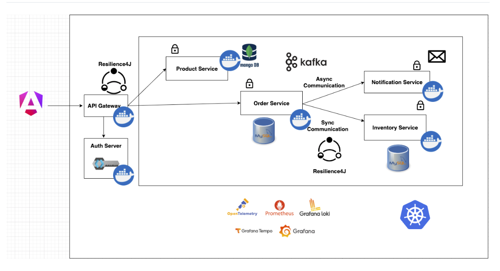

# 🛒 E-Commerce Microservices Application (In Progress)

This project is a scalable **E-Commerce Application** built using **Microservices Architecture**. It demonstrates how to design, develop, and deploy distributed systems using modern enterprise technologies. The application is modular, loosely coupled, and designed to scale.

---

## 🚀 Overview

This system consists of the following microservices:

- 🛍️ **Product Service** – Handles product catalog, creation, and management  
- 📦 **Inventory Service** – Manages stock quantity and availability  
- 🧾 **Order Service** – Places and tracks customer orders  
- 🔔 **Notification Service** – Sends real-time notifications via Kafka  
- 🌐 **API Gateway** – Routes external requests using **Spring Cloud Gateway**  
- 🖥️ **Shop Frontend** – Built with **Angular 18** for dynamic user experience

---
## 🧩 Architecture Overview

## 🛠️ Tech Stack

### Backend:
- Spring Boot (Java)
- Spring Security & OAuth2
- Spring Cloud Gateway
- MongoDB (Product Service)
- MySQL (Order & User Data)
- Kafka (Asynchronous communication)
- Keycloak (Authentication & Authorization)
- Docker + Kubernetes (Containerization & Orchestration)

### Frontend:
- Angular 18

### Testing:
- JUnit
- Mockito
- Test Containers (planned)
- Wiremock (planned)

### Observability (Planned):
- Prometheus
- Grafana
- Loki
- Tempo

---

## 🎯 Key Features

- ✅ Microservices architecture following **Domain-Driven Design (DDD)**
- ✅ Secure communication via **Keycloak & OAuth2**
- ✅ Event-driven communication using **Apache Kafka**
- ✅ API Gateway for centralized routing and load balancing
- ✅ Angular 18 frontend with live inventory and order updates
- 🚧 **Integration testing with Test Containers & Wiremock** (In Progress)
- 🚧 **Monitoring with Prometheus, Grafana, Loki, and Tempo** (To Be Integrated)

---

## 📚 What I'm Learning Through This Project

This project is helping me:

- Understand how to **design scalable distributed systems**
- Learn **inter-service communication** with Kafka and REST APIs
- Master **Spring Security** with JWT & Keycloak for secure microservices
- Gain experience with **Kubernetes deployment and container orchestration**
- Implement **centralized logging, monitoring, and tracing**
- Write clean REST APIs and manage **frontend-backend integration** with Angular
- Practice **integration testing** in a microservices environment

---

